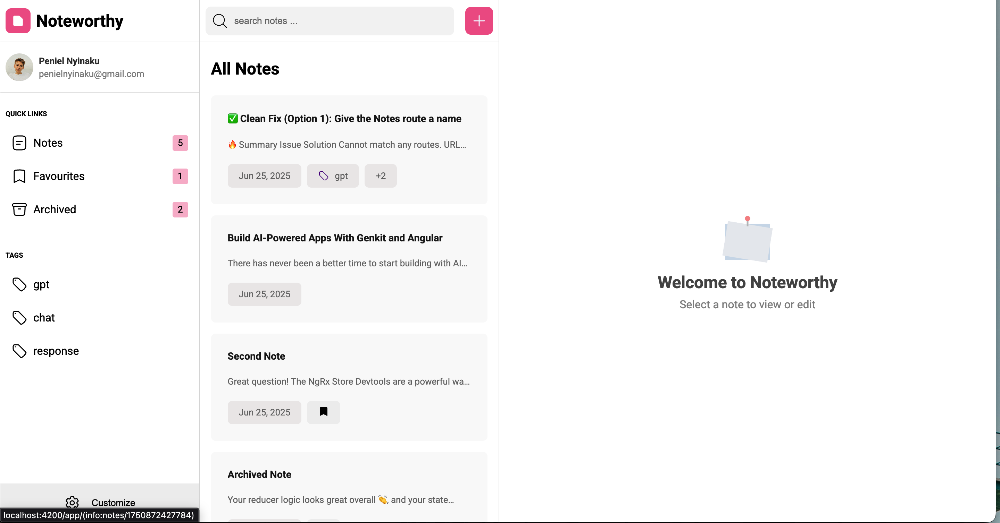

# Noteworthy



notewothy is a simple note-taking application built with Angular. It allows users to create, edit, and delete notes, providing a straightforward interface for managing personal notes.

[Noteworthy Live Demo ](noteworthi.netlify.app)


## Features
- Create, edit, and delete notes
- Search notes by title or content
- Responsive design for mobile and desktop devices
- theming support with custome colors

## Technologies Used
- Angular: A platform for building mobile and desktop web applications.
- TypeScript: A superset of JavaScript that compiles to plain JavaScript.
- RxJS: A library for reactive programming using Observables.


## Run noteworthy locally

To start a local development server, run:

```bash
git clone https://github.com/penielny/noteworthy.git
&& cd noteworthy
&& npm install
&& ng serve
```


Once the server is running, open your browser and navigate to `http://localhost:4200/`. The application will automatically reload whenever you modify any of the source files.


## Building

To build the project run:

```bash
ng build
```

This will compile your project and store the build artifacts in the `dist/` directory. By default, the production build optimizes your application for performance and speed.


## Additional Resources

For more information on using the Angular CLI, including detailed command references, visit the [Angular CLI Overview and Command Reference](https://angular.dev/tools/cli) page.
